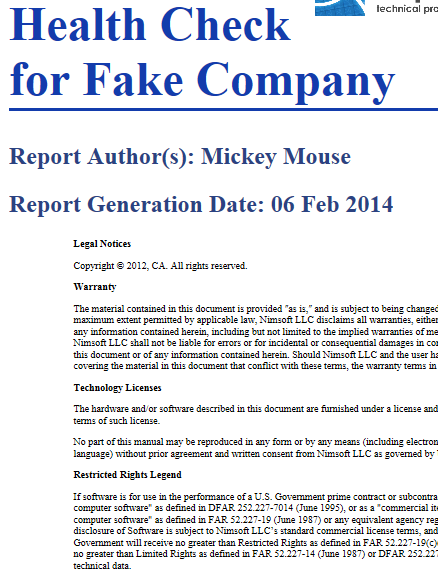

Not too long ago I was tasked with doing a health check for one of our customers. They used one of the products I was less familiar with, so I decided to look at some previous examples of health check reports and see what information I would need to gather and put in the report. It turns out one of my co-workers had already built a script that gathered some of the necessary information. At my request, he modified the output to XML so that I could then take that XML and use and XSLT (eXtensible Stylesheet Language Transformation) to convert it into a nice pretty report in a browser.


Stored data is really comprised of two parts: the data itself and the schema. The schema is the format or syntax of the stored data. For example, let's say I wanted to store my CD collection. For each CD, would probably store the name of the CD, the artist, what country it was released from, the record label, the price I paid, and the year it was released. These descriptive details form the schema of the data I'm going to store. I could store the data in an Excel spreadsheet, with column headers and one row for each CD. That would be pretty easy, but what if the person I was sending the data to didn't have Excel? Plus, if I took one row out of the spreadsheet, I'd also have to copy the column headers so that the person I was sending the one row to would know what each column means. Without the schema information, the data isn't as easy to understand. XML is a language that allows all my data to be transmitted along with complete schema information. Consider the XML for a CD collection:
``` XML
<catalog>
	<cd>
		<title>Empire Burlesque</title>
		<artist>Bob Dylan</artist>
		<country>USA</country>
		<company>Columbia</company>
		<price>10.90</price>
		<year>1985</year>
	</cd>
	<cd>
		<title>Hide your heart</title>
		<artist>Bonnie Tyler</artist>
		<country>UK</country>
		<company>CBS Records</company>
		<price>9.90</price>
		<year>1988</year>
	</cd>
	<cd>
		<title>Greatest Hits</title>
		<artist>Dolly Parton</artist>
		<country>USA</country>
		<company>RCA</company>
		<price>9.90</price>
		<year>1982</year>
	</cd>
	<cd>
		<title>Still got the blues</title>
		<artist>Gary Moore</artist>
		<country>UK</country>
		<company>Virgin records</company>
		<price>10.20</price>
		<year>1990</year>
	</cd>
	<cd>
		<title>Eros</title>
		<artist>Eros Ramazzotti</artist>
		<country>EU</country>
		<company>BMG</company>
		<price>9.90</price>
		<year>1997</year>
	</cd>
	<cd>
		<title>One night only</title>
		<artist>Bee Gees</artist>
		<country>UK</country>
		<company>Polydor</company>
		<price>10.90</price>
		<year>1998</year>
	</cd>
	<cd>
		<title>Sylvias Mother</title>
		<artist>Dr.Hook</artist>
		<country>UK</country>
		<company>CBS</company>
		<price>8.10</price>
		<year>1973</year>
	</cd>
	<cd>
		<title>Maggie May</title>
		<artist>Rod Stewart</artist>
		<country>UK</country>
		<company>Pickwick</company>
		<price>8.50</price>
		<year>1990</year>
	</cd>
	<cd>
		<title>Romanza</title>
		<artist>Andrea Bocelli</artist>
		<country>EU</country>
		<company>Polydor</company>
		<price>10.80</price>
		<year>1996</year>
	</cd>
	<cd>
		<title>When a man loves a woman</title>
		<artist>Percy Sledge</artist>
		<country>USA</country>
		<company>Atlantic</company>
		<price>8.70</price>
		<year>1987</year>
	</cd>
	<cd>
		<title>Black angel</title>
		<artist>Savage Rose</artist>
		<country>EU</country>
		<company>Mega</company>
		<price>10.90</price>
		<year>1995</year>
	</cd>
	<cd>
		<title>1999 Grammy Nominees</title>
		<artist>Many</artist>
		<country>USA</country>
		<company>Grammy</company>
		<price>10.20</price>
		<year>1999</year>
	</cd>
	<cd>
		<title>For the good times</title>
		<artist>Kenny Rogers</artist>
		<country>UK</country>
		<company>Mucik Master</company>
		<price>8.70</price>
		<year>1995</year>
	</cd>
	<cd>
		<title>Big Willie style</title>
		<artist>Will Smith</artist>
		<country>USA</country>
		<company>Columbia</company>
		<price>9.90</price>
		<year>1997</year>
	</cd>
	<cd>
		<title>Tupelo Honey</title>
		<artist>Van Morrison</artist>
		<country>UK</country>
		<company>Polydor</company>
		<price>8.20</price>
		<year>1971</year>
	</cd>
	<cd>
		<title>Soulsville</title>
		<artist>Jorn Hoel</artist>
		<country>Norway</country>
		<company>WEA</company>
		<price>7.90</price>
		<year>1996</year>
	</cd>
	<cd>
		<title>The very best of</title>
		<artist>Cat Stevens</artist>
		<country>UK</country>
		<company>Island</company>
		<price>8.90</price>
		<year>1990</year>
	</cd>
	<cd>
		<title>Stop</title>
		<artist>Sam Brown</artist>
		<country>UK</country>
		<company>A and M</company>
		<price>8.90</price>
		<year>1988</year>
	</cd>
	<cd>
		<title>Bridge of Spies</title>
		<artist>T`Pau</artist>
		<country>UK</country>
		<company>Siren</company>
		<price>7.90</price>
		<year>1987</year>
	</cd>
	<cd>
		<title>Private Dancer</title>
		<artist>Tina Turner</artist>
		<country>UK</country>
		<company>Capitol</company>
		<price>8.90</price>
		<year>1983</year>
	</cd>
	<cd>
		<title>Midt om natten</title>
		<artist>Kim Larsen</artist>
		<country>EU</country>
		<company>Medley</company>
		<price>7.80</price>
		<year>1983</year>
	</cd>
	<cd>
		<title>Pavarotti Gala Concert</title>
		<artist>Luciano Pavarotti</artist>
		<country>UK</country>
		<company>DECCA</company>
		<price>9.90</price>
		<year>1991</year>
	</cd>
	<cd>
		<title>The dock of the bay</title>
		<artist>Otis Redding</artist>
		<country>USA</country>
		<company>Atlantic</company>
		<price>7.90</price>
		<year>1987</year>
	</cd>
	<cd>
		<title>Picture book</title>
		<artist>Simply Red</artist>
		<country>EU</country>
		<company>Elektra</company>
		<price>7.20</price>
		<year>1985</year>
	</cd>
	<cd>
		<title>Red</title>
		<artist>The Communards</artist>
		<country>UK</country>
		<company>London</company>
		<price>7.80</price>
		<year>1987</year>
	</cd>
	<cd>
		<title>Unchain my heart</title>
		<artist>Joe Cocker</artist>
		<country>USA</country>
		<company>EMI</company>
		<price>8.20</price>
		<year>1987</year>
	</cd>
</catalog>
```
See how each piece of data has surrounding tags that help identify what each piece of data means? See how things are nested within each other so that it's easy to see what data pertains to which objects (i.e. which Artist produced which CD)? That's the nice part about XML.

Now, back to the health check. My co-worker had modified his script so that the output was in XML format. That meant that I could then take the XML and easily interpret the data. It also meant that I could build an XSLT which would apply styles, chrome, and extra text to the XML to make it much more readable. Here is what the output of the script looks like. This is the XML, that I want to take and turn into a readable nice report. Ideally, I'd like to turn this into a PDF.
``` XML
<?xml-stylesheet type="text/xsl" href="health_check_files/Health_Check.xsl"?>
<nimsoft>
 <reportinfo>
  <company>Fake Company</company>
  <authors>Mickey Mouse</authors>
  <reportdate>06 Feb 2014</reportdate>
 </reportinfo>
 <NMS>
  <robot>fcnimsvr</robot>
  <os_class>Windows Server 2008 R2 Enterprise Edition, 64-bit Service Pack 1 Build 7601</os_class>
  <processor>Intel(R) Xeon(R) CPU           E5649  @ 2.53GHz</processor>
  <proccount>12</proccount>
  <memory_phy>11.98828125 GB</memory_phy>
  <nim_root>C:\Program Files (x86)\Nimsoft</nim_root>
  <disks>
   <disk id="1">
    <name>C:\</name>
    <free_space>56.234375 GB</free_space>
   </disk>
   <disk id="2">
    <name>E:\</name>
    <free_space>152.2275390625 GB</free_space>
   </disk>
  </disks>
  <dbversion>Microsoft SQL Server 2008 R2 (SP1) - 10.50.2500.0 (X64)  Jun 17 2011 00:54:03  Copyright (c) Microsoft Corporation Enterprise Edition (64-bit) on Windows NT 6.1 &lt;X64&gt; (Build 7601: Service Pack 1)</dbversion>
  <ip>192.168.0.27</ip>
  <nms_ver>Nimsoft Server 6.1</nms_ver>
 </NMS>

 <UMP>
  <robot>fcnimsvr</robot>
  <os_class>Windows Server 2008 R2 Enterprise Edition, 64-bit Service Pack 1 Build 7601</os_class>
  <processor>Intel(R) Xeon(R) CPU           E5649  @ 2.53GHz</processor>
  <proccount>12</proccount>
  <memory_phy>11.98828125 GB</memory_phy>
  <nim_root>C:\Program Files (x86)\Nimsoft</nim_root>
  <disks>
   <disk id="1">
    <name>C:\</name>
    <free_space>56.234375 GB</free_space>
   </disk>
   <disk id="2">
    <name>E:\</name>
    <free_space>152.2275390625 GB</free_space>
   </disk>
  </disks>
  <ip>192.168.0.27</ip>
  <ver>Version      = 6.0.0</ver>
  <port>80</port>
 </UMP>

 <DBS>
  <host>fcSQL01</host>
  <port>1433</port>
  <os_class>Windows Server 2008 R2 Enterprise Service Pack 1</os_class>
  <db_name>NimSLM</db_name>

 <machine_name>fcSQL01</machine_name>
 <memory>
  <row name="0">
   <memory>12276</memory>
   <pagesize>8192</pagesize>
   <hostname>fcsql01.fakecompany.local</hostname>
  </row>
 </memory>
 <os>WINDOWS</os>
 <hostname>fcsql01.fakecompany.local</hostname>
 <IPAddress>192.168.0.28</IPAddress>
 <disk>
  <row name="1">
   <diskdevice>0</diskdevice>
   <type>0</type>
   <filesystem>E:\</filesystem>
   <hostname>fcsql01.fakecompany.local</hostname>
  </row>
  <row name="0">
   <diskdevice>0</diskdevice>
   <type>0</type>
   <filesystem>C:\</filesystem>
   <hostname>fcsql01.fakecompany.local</hostname>
  </row>
 </disk>
 <cpu>
  <row name="0">
   <cpuid>0</cpuid>
   <architecture>x64</architecture>
   <address_width>64</address_width>
   <hostname>fcsql01.fakecompany.local</hostname>
  </row>
 </cpu>
 <os_description>Microsoft Windows Server 2008 R2 Enterprise</os_description>
 </DBS>

 <hubs>
  <hub id="1">
   <name>Monitor_Hub-01</name>
   <subs>2</subs>
  </hub>
  <hub id="2">
   <name>fcbackup</name>
   <subs>2</subs>
  </hub>
  <hub id="3">
   <name>fcNIMSVRhub</name>
   <subs>28</subs>
  </hub>
 </hubs>
</nimsoft>
```


The way to transform this is to build an XSLT and reference that XSLT within the XML itself. See how line 1 has a link to a xsl stylesheet? That's the XSLT. When the XML is opened in a supported browser (IE works best surprisingly), the browser will go find the XSLT and perform the translation against the XML data.
``` XML
<!DOCTYPE stylesheet [
  <!ENTITY % w3centities-f PUBLIC "-//W3C//ENTITIES Combined Set//EN//XML"
      "http://www.w3.org/2003/entities/2007/w3centities-f.ent">
  %w3centities-f;
]>
<xsl:stylesheet version="1.0" xmlns:xsl="http://www.w3.org/1999/XSL/Transform">
<xsl:template match="nimsoft">
 <html>
  <head>
   <link rel="stylesheet" type="text/css" href="health_check_files/Health_Check.css" />
   <title>Nimsoft Health Check</title>
   <script src="health_check_files/functions.js"></script>
  </head>
  <body>
   <div id="helptoggler"></div>
   <a href="http://www.nimsoft.com/"></a>
   <a href="http://www.aspiretp.com/"></a>
   <h1 id="company_name" class="editablecontent" style="margin-left:0px;font-size:48px;padding-top:5%;">
    
    <div id="company_name_content">Health Check for <xsl:value-of select="reportinfo/company" /></div>
   </h1>
   <div id="help" class="prettify" style="display:none;">
    <table>
     <tr><td colspan="2"><h1>Code Examples (<span onclick="hidehelp('help');" style="text-decoration:underline;">hide me before printing</span>)</h1></td></tr>
     <tr><td>Example Code</td><td>Output</td></tr>
     <tr><td>Embedding an image:<br />&lt;img src="health_check_files/Mickey_Mouse.png" class="fw_image" /&gt;<br />Include the class to make sure the final image isn't too wide to fit on the PDF.</td>
      <td></td></tr>
     <tr><td>Building a table:<br />
     &lt;div class="prettify"&gt;&lt;br /&gt;<br />
      &lt;table&gt;<br />
       &lt;tr&gt;&lt;td colspan="2"&gt;Table Header (spans both columns)&lt;/td&gt;&lt;/tr&gt;<br />
       &lt;tr&gt;&lt;td&gt;Column 1 Row 1&lt;/td&gt;&lt;td&gt;Column 2 Row 1&lt;/td&gt;&lt;/tr&gt;<br />
       &lt;tr&gt;&lt;td&gt;Column 1 Row 2&lt;/td&gt;&lt;td&gt;Column 2 Row 2&lt;/td&gt;&lt;/tr&gt;<br />
       &lt;tr&gt;&lt;td&gt;Column 1 Row 3&lt;/td&gt;&lt;td&gt;Column 2 Row 3&lt;/td&gt;&lt;/tr&gt;<br />
       &lt;tr&gt;&lt;td&gt;Column 1 Row 4&lt;/td&gt;&lt;td&gt;Column 2 Row 4&lt;/td&gt;&lt;/tr&gt;<br />
      &lt;/table&gt;<br />
     &lt;/div&gt;<br />
     It's not recommended to nest a table within a table (or you get a blank blue row at the top as seen at right).
     </td><td>
     <div class="prettify"><br />
      <table>
       <tr><td colspan="2">Table Header (spans both columns)</td></tr>
       <tr><td>Column 1 Row 1</td><td>Column 2 Row 1</td></tr>
       <tr><td>Column 1 Row 2</td><td>Column 2 Row 2</td></tr>
       <tr><td>Column 1 Row 3</td><td>Column 2 Row 3</td></tr>
       <tr><td>Column 1 Row 4</td><td>Column 2 Row 4</td></tr>
      </table>
     </div>
     </td></tr>
     <tr><td>Making a bullet list:<br />
     &lt;ul&gt;<br />
     &lt;li&gt;Item 1&lt;/li&gt;<br />
     &lt;li&gt;Item 2&lt;br /&gt;<br />
     With a line break&lt;/li&gt;<br />
     &lt;li&gt;Item 3&lt;br /&gt;<br />
     With a line break and a small image <br />
     &lt;img src="health_check_files/edit-icon.png" class="fw_image" style="height:25px;width:25px"/&gt;&lt;/li&gt;<br />
     &lt;li&gt;Item 4&lt;br /&gt;<br />
     With 2 line breaks and a large image<br />&lt;br /&gt;&lt;img src="health_check_files/Mickey_Mouse.png" class="fw_image" /&gt;&lt;/li&gt;<br />
     &lt;/ul&gt;<br />
     </td><td>
          <ul>
     <li>Item 1</li>
     <li>Item 2<br />
     With a line break</li>
     <li>Item 3<br />
     With a line break and a small image </li>
     <li>Item 4<br />
     With 2 line breaks and a large image<br /></li>
     </ul>
     </td></tr>
     <tr><td><span class="emphasis">Text that is bolded and underlined</span></td><td>&lt;span class="emphasis"&gt;Text that is bolded and underlined&lt;/span&gt;</td></tr>
     <tr><td>Inserting space between elements:<br />
     Some Text<br />
     &lt;div class="separator" /&gt;<br />
     More Text</td>
     <td>Some Text
     <div class="separator" />
     More Text</td></tr>
     <tr><td>Inserting less space between elements:<br />
     Some Text<br />
     &lt;div class="littleseparator" /&gt;<br />
     More Text</td>
     <td>Some Text
     <div class="littleseparator" />
     More Text</td></tr>
    </table>
   </div>
   <h2 id="authors" class="editablecontent" style="margin-left:0px;">
    
    <div id="authors_content" style="margin:0px; width:100%">Report Author(s): <xsl:value-of select="reportinfo/authors" /></div>
   </h2>
   <h2 id="report_date" class="editablecontent" style="margin-left:0px;">
    
    <div id="report_date_content" style="margin:0px; width:100%">Report Generation Date: <xsl:value-of select="reportinfo/reportdate" /></div>
   </h2>
   <div id="legal_notices">
   <p class="highlight">Legal Notices</p>
   <p>Copyright &copy; 2012, CA. All rights reserved. </p>
   <p class="highlight">Warranty</p>
   <p>The material contained in this document is provided ʺas is,ʺ and is subject to being changed, without notice, in future editions. Further, to the maximum extent permitted by applicable law, Nimsoft LLC disclaims all warranties, either express or implied, with regard to this manual and any information contained herein, including but not limited to the implied warranties of merchantability and fitness for a particular purpose. Nimsoft LLC shall not be liable for errors or for incidental or consequential damages in connection with the furnishing, use, or performance of this document or of any information contained herein. Should Nimsoft LLC and the user have a separate written agreement with warranty terms covering the material in this document that conflict with these terms, the warranty terms in the separate agreement shall control.</p>
   <p class="highlight">Technology Licenses</p>
   <p>The hardware and/or software described in this document are furnished under a license and may be used or copied only in accordance with the terms of such license.</p>
   <p>No part of this manual may be reproduced in any form or by any means (including electronic storage and retrieval or translation into a foreign language) without prior agreement and written consent from Nimsoft LLC as governed by United States and international copyright laws.</p>
   <p class="highlight">Restricted Rights Legend</p>
   <p>If software is for use in the performance of a U.S. Government prime contract or subcontract, Software is delivered and licensed as "Commercial computer software" as defined in DFAR 252.227-7014 (June 1995), or as a "commercial item" as defined in FAR 2.101(a) or as "Restricted computer software" as defined in FAR 52.227-19 (June 1987) or any equivalent agency regulation or contract clause. Use, duplication or disclosure of Software is subject to Nimsoft LLC’s standard commercial license terms, and non-DOD Departments and Agencies of the U.S. Government will receive no greater than Restricted Rights as defined in FAR 52.227-19(c)(1-2) (June 1987). U.S. Government users will receive no greater than Limited Rights as defined in FAR 52.227-14 (June 1987) or DFAR 252.227-7015 (b)(2) (November 1995), as applicable in any technical data.</p>
   </div>
   <div id="executive_overview">
    <h1>Executive Overview</h1>
    <p>Nimsoft periodically performs health checks for our customers to ensure they are getting the most out of their investment in our products.</p>
    <p>Our approach seeks to assess the current architecture, deployment, and running characteristics of the Nimsoft products and provide recommendations on areas for improvement based on our findings.</p>
    <p>Through the Health Check process we:</p>
    <ul>
     <li>Validate the deployment architecture</li>
     <li>Assess the overall functioning of the products</li>
     <li>Recommend areas for improvement in use of Nimsoft products</li>
    </ul>
    <p>We typically review the following areas of your Nimsoft deployment:</p>
    <ul>
     <li>Deployment Architecture</li>
     <li>Hub Configuration</li>
     <li>Alarm Console and Auto-Operator Rules</li>
     <li>Unified Monitoring Portal</li>
     <li>Database Health</li>
    </ul>
    <h2>Summary Recommendations</h2>
    <div id="recsummary" class="editablecontent">
     
     <div id="recsummary_content">
      <xsl:if test="reportinfo/recsummary!=''"><xsl:value-of select="reportinfo/recsummary" disable-output-escaping="yes"/></xsl:if>
      <xsl:if test="not(reportinfo/recsummary) or (reportinfo/recsummary='')">Provide a summary description of your recommendations<br /><span class="example">EXAMPLE</span>: The primary recommendations resulting from the data gathering, assessment, and analysis performed during this Health Check are to upgrade both hardware and software on the core NMS components of the infrastructure. In addition to hardware and software upgrades, a review of the alarm/event management process is recommended. Architecturally, the NMS deployment is in accordance with a “Best Practices” implementation for an organization of this size.</xsl:if>
     </div>
    </div>
    <p>The detailed specifications and recommendations are presented in <a href="#recommendations">the subsequent sections of this document</a>.</p>
   </div>
   <h1>Installed Versions &amp; Environments</h1>
   <div id="installed_versions_environments" class="editablecontent">
    
    <div id="installed_versions_environments_content">
     <xsl:if test="reportinfo/installed_versions_environments!=''"><xsl:value-of select="reportinfo/installed_versions_environments" disable-output-escaping="yes" /></xsl:if>
     <xsl:if test="(reportinfo/installed_versions_environments='') or not(reportinfo/installed_versions_environments)">Detail the various environments installed at the customer site. Include version information of all primary components (UMP, NMS, NSD, etc.).<br /><span class="example">EXAMPLE</span>: CHS has the Nimsoft Monitoring Solution (NMS) installed in the Production Environment.</xsl:if>
    </div>
   </div>
   <h2>The current installed versions are:</h2>
   <p class="highlight">NMS Server (<xsl:value-of select="NMS/robot" />)</p>
   <ul>
    <li><xsl:value-of select="NMS/nms_ver" /></li>
    <li><xsl:value-of select="NMS/os_class" /></li>
   </ul>
   <p class="highlight">UMP (<xsl:value-of select="UMP/robot" />)</p>
   <ul>
    <li><xsl:value-of select="UMP/ver" /></li>
    <li><xsl:value-of select="UMP/os_class" /></li>
   </ul>
   <p class="highlight">Database Server (<xsl:value-of select="DBS/host" />)</p>
   <ul>
    <li><xsl:value-of select="DBS/os_class" /></li>
    <li><xsl:value-of select="NMS/dbversion" /></li>
    <!-- <li><xsl:value-of select="DBS/db_ver" /></li> -->
   </ul>
   <h1>Server Sizing - Current</h1>
   <div id="sizing" class="editablecontent">
    
    <div id="sizing_content">
     <xsl:if test="reportinfo/sizing!=''"><xsl:value-of select="reportinfo/sizing" disable-output-escaping="yes"/></xsl:if>
     <xsl:if test="(reportinfo/sizing='') or not(reportinfo/sizing)">Describe the server specifications for the NMS Server, UMP Server, and Database Server (memory, OS, virtual or physical, etc.). You can provide additional server details in an Appendix.<br /><span class="example">EXAMPLE</span>:The following tables show the current hardware and software specifications and versions for the Nimsoft server(s).</xsl:if>
    </div>
   </div>
   <div class="littleseparator" />
   <xsl:apply-templates select="NMS" />
   <div class="littleseparator" />
   <xsl:apply-templates select="UMP" />
   <div class="littleseparator" />
   <xsl:apply-templates select="DBS" />
   <div class="littleseparator" />
   <xsl:apply-templates select="hubs" />
   <h1>Architecture Overview</h1>
   <div id="arch_overview" class="editablecontent">
    
    <div id="arch_overview_content">
     <xsl:if test="reportinfo/arch_overview!=''"><xsl:value-of select="reportinfo/arch_overview" disable-output-escaping="yes"/></xsl:if>
     <xsl:if test="(reportinfo/arch_overview='') or not(reportinfo/arch_overview)">Provide an overview of the customer’s architecture. For extensive reference data, such as a hub report, include that data in an appendix.<br /><span class="example">EXAMPLE</span>: The CHS production NMS implementation is a three-tiered architecture. The top tier consists of an HA pair of hubs, a multi-UMP installation, and a MS SQL Server cluster. The mid, or second tier consists of five HA paired sets of “Proxy” hubs. These hubs are analogous to “tunnel hub servers” in other three-tier implementations except that there are no SSL tunnels being used – only Named Services. The third tier is made up of the remote site/location hubs. Attach-get queue pairs are used to pass the monitoring data up through the infrastructure to the Primary hub. Alarms and QoS have been split into individual queues. The three-tier architecture currently implemented at CHS conforms to the Nimsoft “Best Practice” architecture for large scale, geographically dispersed deployments.<br />There are approximately 204 hubs in total. (See the Hub Summary Report, Appendix A., for a listing of current hubs.) “Name Services” is used throughout the entire implementation. This is made possible due to the “flat” nature of the CHS network topology and the use of Named Services instead of tunnels also conforms to the Nimsoft “Best Practices” recommendations with regards to hub-to-hub connectivity. The majority of the hubs are currently installed/designated as HA pairs (an A and B hub).<br />CHS has configured NAS Replication between the tier 1 Primary and Secondary hub nas probes. The replication is bi-directional and is for alarms only. There is no replication for the configuration and/or scripts enabled.</xsl:if>
    </div>
   </div>
   <h1>Event Management</h1>
   <div id="event_mgmt" class="editablecontent">
    
    <div id="event_mgmt_content">
     <xsl:if test="reportinfo/event_mgmt!=''"><xsl:value-of select="reportinfo/event_mgmt" disable-output-escaping="yes" /></xsl:if>
     <xsl:if test="(reportinfo/event_mgmt='') or not(reportinfo/event_mgmt)">Present your evaluation of the customer’s event management. Include relevant screenshots, such as the Alarm SubConsole and Auto Operator Profiles. Be sure to consider the following in your evaluation:
     <ul>
      <li>Number and pace of alarms</li>
      <li>Suppression counts</li>
      <li>NAS configuration and alert replication</li>
      <li>Auto-Operator profiles in use, conflicts, overuse</li>
      <li>Triggers in use</li>
      <li>Scripts in use</li>
      <li>Ticketing System integration (if applicable)</li>
     </ul>
     For extensive reference data, such as an alarm report, include that data in an appendix. Highlight specific recommendations in Recommendation paragraphs, addressing the different parts of your evaluation.<br />
     <span style="font-weight:bold;color:red;">EXAMPLE SCREENSHOT</span>:<br />
     <span style="font-style:italic;">Auto-Operator Profiles</span><br />
     </xsl:if>
    </div>
   </div>
   <h1>Current Infrastructure Performance</h1>
   <div id="inf_perf" class="editablecontent">
    
    <div id="inf_perf_content">
     <xsl:if test="reportinfo/inf_perf!=''"><xsl:value-of select="reportinfo/inf_perf" disable-output-escaping="yes"/></xsl:if>
     <xsl:if test="(reportinfo/inf_perf='') or not(reportinfo/inf_perf)">Describe the performance of the current infrastructure, covering Primary/Secondary Hub, Database Server, UMP Server, and Proxy/Database Hubs. For extensive reference data, such as a performance and resource utilization report, include that data in an appendix. Call out specific recommendations in Recommendation paragraphs, addressing the different parts of your evaluation.</xsl:if>
    </div>
   </div>
   <h1>SLA Requirements Review</h1>
   <div id="sla_req_review" class="editablecontent">
    
    <div id="sla_req_review_content">
     <xsl:if test="reportinfo/sla_req_review!=''"><xsl:value-of select="reportinfo/sla_req_review" disable-output-escaping="yes"/></xsl:if>
     <xsl:if test="(reportinfo/sla_req_review='') or not(reportinfo/sla_req_review)">Describe the current SLA requirements and any additional desired requirements. Call out specific recommendations in a Recommendation paragraph.</xsl:if>
    </div>
   </div>
   <h1>Reporting &amp; Visualization Requirements Review</h1>
   <div id="report_viz_req_review" class="editablecontent">
    
    <div id="report_viz_req_review_content">
     <xsl:if test="reportinfo/report_viz_req_review!=''"><xsl:value-of select="reportinfo/report_viz_req_review" disable-output-escaping="yes"/></xsl:if>
     <xsl:if test="(reportinfo/report_viz_req_review='') or not(reportinfo/report_viz_req_review)">Describe the use of custom Dashboards, Reports, and SLA Reports. Provide representative screenshots of each as applicable.</xsl:if>
    </div>
   </div>
   <h1>Open Issues</h1>
   <div id="open_issues" class="editablecontent">
    
    <div id="open_issues_content">
     <xsl:if test="reportinfo/open_issues!=''"><xsl:value-of select="reportinfo/open_issues" disable-output-escaping="yes"/></xsl:if>
     <xsl:if test="(reportinfo/open_issues='') or not(reportinfo/open_issues)">
      Review the customer’s open Support cases.<br /><br /><br />
      <div class="prettify" style="margin:0px;border:1px solid #6d89d5;">
       <table>
        <tr><td>Case ID</td><td>Description</td><td>Status</td></tr>
        <tr><td></td><td></td><td></td></tr>
        <tr><td></td><td></td><td></td></tr>
        <tr><td></td><td></td><td></td></tr>
        <tr><td></td><td></td><td></td></tr>
       </table>
      </div>
     </xsl:if>
    </div>
   </div>
   <a id="recommendations" />
   <h1>Findings &amp; Recommendations</h1>
   <div id="findings_recs" class="editablecontent">
    
    <div id="findings_recs_content">
     <xsl:if test="reportinfo/findings_recs!=''"><xsl:value-of select="reportinfo/findings_recs" disable-output-escaping="yes"/></xsl:if>
     <xsl:if test="(reportinfo/findings_recs='') or not(reportinfo/findings_recs)">Provide details of the findings and recommendations for this Health Check. Suggested topics to cover are provided to organize your statements.</xsl:if>
    </div>
   </div>
   <h2>Product Version / Upgrade Path &amp; Process Recommendations</h2>
   <div id="findings_ver" class="editablecontent">
    
    <div style="min-height:25px" id="findings_ver_content">
     <xsl:if test="reportinfo/findings_ver!=''"><xsl:value-of select="reportinfo/findings_ver" disable-output-escaping="yes"/></xsl:if>
     <xsl:if test="(reportinfo/findings_ver='') or not(reportinfo/findings_ver)">Sample text</xsl:if>
    </div>
   </div>
   <h2>Sizing Recommendations</h2>
   <div id="findings_sizing" class="editablecontent">
    
    <div style="min-height:25px" id="findings_sizing_content">
     <xsl:if test="reportinfo/findings_sizing!=''"><xsl:value-of select="reportinfo/findings_sizing" disable-output-escaping="yes"/></xsl:if>
     <xsl:if test="(reportinfo/findings_sizing='') or not(reportinfo/findings_sizing)">Sample text</xsl:if>
    </div>
   </div>
   <h2>Architectural Recommendations</h2>
   <div id="findings_arch" class="editablecontent">
    
    <div style="min-height:25px" id="findings_arch_content">
     <xsl:if test="reportinfo/findings_arch!=''"><xsl:value-of select="reportinfo/findings_arch" disable-output-escaping="yes"/></xsl:if>
     <xsl:if test="(reportinfo/findings_arch='') or not(reportinfo/findings_arch)">Sample text</xsl:if>
    </div>
   </div>
   <h2>Database Recommendations</h2>
   <div id="findings_db" class="editablecontent">
    
    <div style="min-height:25px" id="findings_db_content">
     <xsl:if test="reportinfo/findings_db!=''"><xsl:value-of select="reportinfo/findings_db" disable-output-escaping="yes"/></xsl:if>
     <xsl:if test="(reportinfo/findings_db='') or not(reportinfo/findings_db)">Sample text</xsl:if>
    </div>
   </div>
   <h2>Event Management Recommendations</h2>
   <div id="findings_event_mgmt" class="editablecontent">
    
    <div style="min-height:25px" id="findings_event_mgmt_content">
     <xsl:if test="reportinfo/findings_event_mgmt!=''"><xsl:value-of select="reportinfo/findings_event_mgmt" disable-output-escaping="yes"/></xsl:if>
     <xsl:if test="(reportinfo/findings_event_mgmt='') or not(reportinfo/findings_event_mgmt)">Sample text</xsl:if>
    </div>
   </div>
   <h2>Infrastructure Performance Recommendations</h2>
   <div id="findings_inf_perf" class="editablecontent">
    
    <div style="min-height:25px" id="findings_inf_perf_content">
     <xsl:if test="reportinfo/findings_inf_perf!=''"><xsl:value-of select="reportinfo/findings_inf_perf" disable-output-escaping="yes"/></xsl:if>
     <xsl:if test="(reportinfo/findings_inf_perf='') or not(reportinfo/findings_inf_perf)">Sample text</xsl:if>
    </div>
   </div>
   <h2>SLA Requirements Recommendations</h2>
   <div id="findings_sla" class="editablecontent">
    
    <div style="min-height:25px" id="findings_sla_content">
     <xsl:if test="reportinfo/findings_sla!=''"><xsl:value-of select="reportinfo/findings_sla" disable-output-escaping="yes"/></xsl:if>
     <xsl:if test="(reportinfo/findings_sla='') or not(reportinfo/findings_sla)">Sample text</xsl:if>
    </div>
   </div>
   <h2>Visualization &amp; Reporting Recommendations</h2>
   <div id="findings_viz_report" class="editablecontent">
    
    <div style="min-height:25px" id="findings_viz_report_content">
     <xsl:if test="reportinfo/findings_viz_report!=''"><xsl:value-of select="reportinfo/findings_viz_report" disable-output-escaping="yes"/></xsl:if>
     <xsl:if test="(reportinfo/findings_viz_report='') or not(reportinfo/findings_viz_report)">Sample text</xsl:if>
    </div>
   </div>
   <h2>Open Issue Recommendations</h2>
   <div id="findings_open_issue" class="editablecontent">
    
    <div style="min-height:25px" id="findings_open_issue_content">
     <xsl:if test="reportinfo/findings_open_issue!=''"><xsl:value-of select="reportinfo/findings_open_issue" disable-output-escaping="yes"/></xsl:if>
     <xsl:if test="(reportinfo/findings_open_issue='') or not(reportinfo/findings_open_issue)">Sample text</xsl:if>
    </div>
   </div>
   <h1>Next Steps</h1>
   <p>The Nimsoft Health Check is typically a starting point – a way to identify opportunities for improvement, a baseline for assessing issues, and a guideline for future enhancement to the CHS implementation.</p>
   <p>Should you have any questions about this Health Check or if there are significant errors or omissions, please contact the author:</p>
   <div id="contact_author" class="editablecontent">
    
    <div id="contact_author_content">
     <xsl:if test="reportinfo/authors!=''"><xsl:value-of select="reportinfo/authors" /></xsl:if>
     <xsl:if test="(reportinfo/authors='') or not(reportinfo/authors)">Aspire Technical Professionals</xsl:if>
    </div>
   </div>
   <div id="contact_title" class="editablecontent">
    
    <div id="contact_title_content">
     <xsl:if test="reportinfo/contact_title!=''"><xsl:value-of select="reportinfo/contact_title" /></xsl:if>
     <xsl:if test="(reportinfo/contact_title='') or not(reportinfo/contact_title)">Senior Consulting Team</xsl:if>
    </div>
   </div>
   <div id="contact_email" class="editablecontent">
    
    <div id="contact_email_content">
     <xsl:if test="reportinfo/contact_email!=''"><xsl:element name="a"><xsl:attribute name="href">mailto:<xsl:value-of select="reportinfo/contact_email" /></xsl:attribute><xsl:value-of select="reportinfo/contact_email" /></xsl:element></xsl:if>
     <xsl:if test="(reportinfo/contact_email='') or not(reportinfo/contact_email)"><a href="mailto:info@aspiretp.com">info@aspiretp.com</a></xsl:if>
    </div>
   </div>
   <div id="contact_phone" class="editablecontent">
    
    <div id="contact_phone_content">
     <xsl:if test="reportinfo/contact_phone!=''"><xsl:value-of select="reportinfo/contact_phone" /></xsl:if>
     <xsl:if test="(reportinfo/contact_phone='') or not(reportinfo/contact_phone)">Contact Phone Number</xsl:if>
    </div>
   </div>
  </body>
 </html>
</xsl:template>


<xsl:template match="NMS">
 <div class="prettify">
  <table>
   <tr><td colspan="2"><h1>NMS Server</h1></td></tr>
   <tr><td>Robot</td><td><xsl:value-of select="robot" /></td></tr>
   <tr><td>OS</td><td><xsl:value-of select="os_class" /></td></tr>
   <tr><td>Processor</td><td><xsl:value-of select="processor" /></td></tr>
   <tr><td>Number of processors</td><td><xsl:value-of select="proccount" /></td></tr>
   <tr><td>Memory Installed</td><td><xsl:value-of select="memory_phy" /></td></tr>
   <tr><td>Installation Path</td><td><xsl:value-of select="nim_root" /></td></tr>
   <tr><td>Database Version Information</td><td><xsl:value-of select="dbversion" /></td></tr>
   <tr><td>IP Address</td><td><xsl:value-of select="ip" /></td></tr>
   <tr><td>NMS Version</td><td><xsl:value-of select="nms_ver" /></td></tr>
   <tr>
    <td colspan="2">
     <div class="littleseparator" />
     <table id="umpdisks">
      <tr><td colspan="2"><h2>Physical Disks</h2></td></tr>
      <tr><td><h3>Disk</h3></td><td><h3>Free Space</h3></td></tr>
      <xsl:apply-templates select="disks/disk" />
     </table>
     <div class="littleseparator" />
    </td>
   </tr>
  </table>
 </div>
</xsl:template>
<xsl:template match="UMP">
 <div class="prettify">
  <table>
   <tr><td colspan="2"><h1>UMP Server</h1></td></tr>
   <tr><td>Robot</td><td><xsl:value-of select="robot" /></td></tr>
   <tr><td>OS</td><td><xsl:value-of select="os_class" /></td></tr>
   <tr><td>Processor</td><td><xsl:value-of select="processor" /></td></tr>
   <tr><td>Number of processors</td><td><xsl:value-of select="proccount" /></td></tr>
   <tr><td>Memory Installed</td><td><xsl:value-of select="memory_phy" /></td></tr>
   <tr><td>Installation Path</td><td><xsl:value-of select="nim_root" /></td></tr>
   <tr><td>IP Address</td><td><xsl:value-of select="ip" /></td></tr>
   <tr><td>UMP Version</td><td><xsl:value-of select="ver" /></td></tr>
   <tr><td>Port</td><td><xsl:value-of select="port" /></td></tr>
   <tr>
    <td colspan="2">
     <div class="littleseparator" />
     <table id="umpdisks">
      <tr><td colspan="2"><h2>Physical Disks</h2></td></tr>
      <tr><td><h3>Disk</h3></td><td><h3>Free Space</h3></td></tr>
      <xsl:apply-templates select="disks/disk" />
     </table>
     <div class="littleseparator" />
    </td>
   </tr>
  </table>
 </div>
</xsl:template>
<xsl:template match="disks/disk">
 <tr>
  <td><xsl:value-of select="name" /></td>
  <td><xsl:value-of select="free_space" /></td>
 </tr>
</xsl:template>
<xsl:template match="DBS">
 <div class="prettify">
  <table>
   <tr><td colspan="2"><h1>Database Server</h1></td></tr>
   <tr><td>Hostname</td><td><xsl:value-of select="hostname" /></td></tr>
   <tr><td>Port</td><td><xsl:value-of select="port" /></td></tr>
   <tr><td>OS</td><td><xsl:value-of select="os" /></td></tr>
   <tr><td>OS Class</td><td><xsl:value-of select="os_class" /></td></tr>
   <tr><td>OS Details</td><td><xsl:value-of select="os_description" /></td></tr>
   <tr><td>Database Name</td><td><xsl:value-of select="db_name" /></td></tr>
   <tr><td>Machine Name</td><td><xsl:value-of select="machine_name" /></td></tr>
   <tr><td>Hostname (FQDN)</td><td><xsl:value-of select="hostname" /></td></tr>
   <tr><td>IPAddress</td><td><xsl:value-of select="IPAddress" /></td></tr>
   <tr>
    <td colspan="2">
     <div class="littleseparator" />
     <table id="CPU">
      <tr><td colspan="3"><h2>CPU Information</h2></td></tr>
      <tr>
       <!-- <td>Name</td> -->
       <td>CPU ID</td>
       <td>Architecture</td>
       <td>Address Width</td>
       <!-- <td>Hostname</td> -->
      </tr>
      <xsl:apply-templates select="cpu/row" />
     </table>
     <div class="littleseparator" />
     <table id="memory">
      <tr><td colspan="2"><h2>Memory Information</h2></td></tr>
      <tr>
       <!-- <td>Name</td> -->
       <td>RAM</td>
       <td>SWAP</td>
       <!-- <td>Hostname</td> -->
      </tr>
      <xsl:apply-templates select="memory/row" />
     </table>
     <div class="littleseparator" />
     <table id="disk">
      <tr><td><h2 colspan="1">Disk Information</h2></td></tr>
      <tr>
       <!-- <td>Name</td> -->
       <!-- <td>DiskDevice</td> -->
       <!-- <td>Type</td> -->
       <td>File System</td>
       <!-- <td>Hostname</td> -->
      </tr>
      <xsl:apply-templates select="disk/row" />
     </table>
     <div class="littleseparator" />
    </td>
   </tr>
  </table>
 </div>
</xsl:template>
<xsl:template match="memory/row">
 <tr>
  <!-- <td><xsl:value-of select="@name" /></td> -->
  <td><xsl:value-of select="memory" /></td>
  <td><xsl:value-of select="pagesize" /></td>
  <!-- <td><xsl:value-of select="hostname" /></td> -->
 </tr>
</xsl:template>
<xsl:template match="cpu/row">
 <tr>
  <!-- <td><xsl:value-of select="@name" /></td> -->
  <td><xsl:value-of select="cpuid" /></td>
  <td><xsl:value-of select="architecture" /></td>
  <td><xsl:value-of select="address_width" /></td>
  <!-- <td><xsl:value-of select="hostname" /></td> -->
 </tr>
</xsl:template>
<xsl:template match="disk/row">
 <tr>
  <!-- <td><xsl:value-of select="@name" /></td> -->
  <!-- <td><xsl:value-of select="diskdevice" /></td> -->
  <!-- <td><xsl:value-of select="type" /></td> -->
  <td><xsl:value-of select="filesystem" /></td>
  <!-- <td><xsl:value-of select="hostname" /></td> -->
 </tr>
</xsl:template>
<xsl:template match="hubs">
 <div class="prettify">
  <table>
   <tr><td colspan="2"><h1>Hubs</h1></td></tr>
   <tr>
    <!-- <td>ID</td> -->
    <td>Name</td>
    <td>Subscriber Count</td>
   </tr>
   <xsl:apply-templates select="hub" />
  </table>
 </div>
</xsl:template>
<xsl:template match="hub">
 <tr>
  <!-- <td><xsl:value-of select="@id" /></td> -->
  <td><xsl:value-of select="name" /></td>
  <td><xsl:value-of select="subs" /></td>
 </tr>
</xsl:template>
</xsl:stylesheet>
```


Ok, that's not too bad, right? Ok, let's go through the magic one piece at a time. The first 6 lines are pretty standard XSLT. The good stuff starts online 7. In a way, the XSLT will be merged with the XML. Technically, the XSLT is inserted into the XML document, but it is almost easier to think about the XML being inserted into the XSLT (it's actually because of this that most people actually incorrectly say that XSLT is in HTML format thinking that it's the HTML that the XML gets inserted into, but I digress).
So, line 7 starts an XSL template. The XSL template here essentially says to go to the tag in the XML called 'nimsoft' and insert some HTML. (By the way, whenever an XSLT is applied, the underlying XML is pretty much hidden except where the XSLT specifies that it should be displayed.) So lines 8-19 are pretty standard HTML document headers. 
Line 20 is the first place where we're going to insert some of the XML data. The `<xsl:value-of select="reportinfo/company" />` tag instructs the browser to display the value inside the company tag, which is under the reportinfo tag, which is under the nimsoft tag. In the final HTML, line 20 would look like this:
`<div id="company_name_content">Health Check for Fake Company</div>`
Lines 21-88 are more standard HTML. This section of the report is displayed to help the author make some changes after the initial version is rendered.
Lines 89-96 make use of the `xsl:value-of` tag to pull in more XML data. This time, pulling from the nimsoft/reportinfo/authors tag (e.g. Mickey Mouse) and the nimsoft/reportinfo/reportdate tag (e.g. 06 Feb 2014).
Lines 97-107 contain a simple legal notice, another standard HTML block. Remember, all the standard HTML is just inserted at the point of the last template match. So, we're still inserting onto the root of the XML.
Lines 108-135 begins the first section of the actual report and is more standard HTML, with a couple xsl tags. The first is at line 130, which uses the `xsl:if` statement to check to see if there is a value at the nimsoft/reportinfo/recsummary tag. If there is something there, the `xsl:value-of` tag displays it. It also uses the disable-output-escaping attribute, which means that the XML can contain valid HTML. Line 131 uses the `xsl:if` again checking for the existence of the nimsoft/reportinfo/recsummary tag or if it's empty. If it doesn't exist or it's empty, some boiler plate HTML is inserted instead of what we would have expected from the XML. This is handy since it allows that tag to be optional in the XML.
Up to this point, I've been using something called XPath to reference particular tags within the XML. XPath is a specification that allows tags to be referenced using their path in the XML. So far, I've shown how the root template has worked. Within any of the `xsl:value-of` tags, the select attribute has used XPath to specify a particular tag. Since I've been working within the root template (nimsoft), that part of the path is implied.
From lines 136-169, I follow the same pattern already established: put some raw HTML on the page, insert some values from particular XML tags using XPath. This also applies to lines 177-367. It all uses the same basic concepts.
However, lines 170, 172, 174, & 176 use the `xsl:apply-templates` tag. This xsl tag instructs the browser to move down to the specified node in the XML and loop through the children of that node. This is similar to calling a function from within a program.
Line 170 specifies to go to the NMS node. Since we're inside the nimsoft template, that means the browser will move to the nimsoft/NMS node and loop through the children. To see what the browser does, look at lines 368-394. These lines specify what to do whenever the `xsl:apply-templates` tag is used for any node called NMS.
Particularly, this piece of the XSLT builds a table and inserts the values of the various children nodes of the NMS node (lines 369-383 &amp; 389-393). Lines 384-388 specify another `xsl:apply-templates` tag (disks/disk), which means the browser moves to that node and processes the children; see lines 422-427. This nested template outputs a single row for each disk under NMS/disks/. Once all the children are processed, the browser returns to the template that called the apply-templates tag.
Lines 172, 174, & 176 use similar templates, which either call their own templates or existing templates. For example, both the NMS and UMP templates call the disks/disk template since the disks are stored in the same way as the parent.
And that's about it. By walking through the XSLT with the XML right beside it, you can see how the final result is made. Simply opening the XML in IE was enough to get the information to display. It is pretty trivial from there to generate a PDF version of the report.



